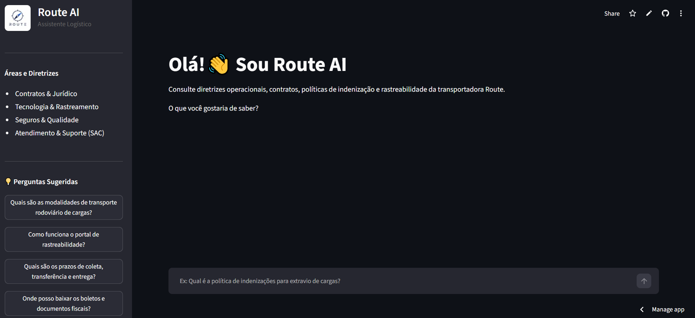
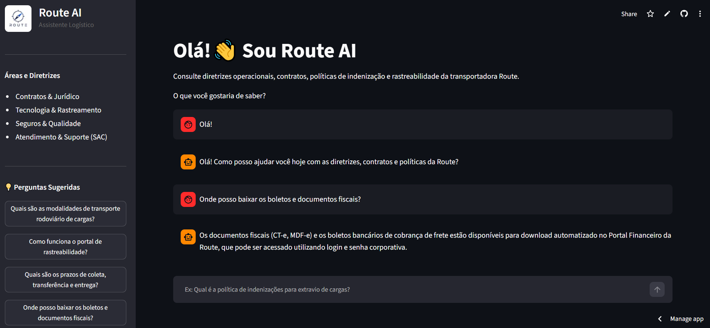

# Route AI — Assistente Corporativo Logístico

> Assistente inteligente para consulta de documentos e diretrizes operacionais utilizando **Inteligência Artificial Generativa e RAG (Retrieval-Augmented Generation)**.

<p align="center">
  
  
</p>

<p align="center">
  🌐 <a href="https://routeai.streamlit.app/"><strong>Acessar Aplicação</strong></a>
</p>

<p align="center">
  
</p>

O **Route AI** é uma aplicação desenvolvida para demonstrar como IA Generativa pode ser aplicada ao contexto de **logística e transporte**, permitindo que usuários consultem informações de uma base documental por meio de linguagem natural.

A aplicação utiliza **RAG** para recuperar informações relevantes dos documentos e fornecer respostas contextualizadas com base no conteúdo disponível na base de conhecimento.

## ✨ Funcionalidades

* 💬 Consulta de documentos por linguagem natural
* 🔎 Busca semântica utilizando embeddings
* 🤖 Geração de respostas com LLM
* 🧠 Arquitetura RAG para recuperação de contexto
* 🖥️ Interface interativa desenvolvida com Streamlit
* 🔒 Controle de respostas por meio de System Prompt
* 🧩 Arquitetura modular para processamento, RAG e interface

## 🛠️ Tecnologias

* **Python**
* **Streamlit**
* **LangChain**
* **Google Gemini**
* **Hugging Face Embeddings**
* **ChromaDB**
* **python-dotenv**

📁 Estrutura

route/
├── assets/
│   ├── logo-route.png
│   ├── routeai-home.png
│   └── routeai-response.png
├── documents/
│   ├── central_ajuda_route.pdf
│   ├── condicoes_gerais_frete_route.pdf
│   ├── politica_indenizacoes_route.pdf
│   ├── portal_rastreabilidade_route.pdf
│   └── sac_ouvidoria_route.pdf
├── .gitattributes
├── .gitignore
├── LICENSE
├── README.md
├── app.py
├── data.py
├── prompt.py
└── rag.py

### Responsabilidade dos principais arquivos

| Arquivo     | Função                                          |
| ----------- | ----------------------------------------------- |
| `app.py`    | Interface e interação com o usuário             |
| `data.py`   | Processamento e preparação dos documentos       |
| `rag.py`    | Recuperação de contexto e geração das respostas |
| `prompt.py` | Regras e comportamento do assistente            |

## 🔄 Arquitetura RAG

```text
Documentos
    ↓
Processamento
    ↓
Embeddings
    ↓
Base Vetorial
    ↓
Busca Semântica
    ↓
Contexto Relevante
    ↓
Google Gemini
    ↓
Resposta
```

## 📄 Dados demonstrativos

> **Importante:** os documentos disponibilizados neste projeto são **dados demonstrativos e simulados**, criados exclusivamente para fins educacionais e de demonstração da aplicação.

Eles **não representam documentos corporativos reais, informações confidenciais ou dados operacionais oficiais da Route Transportadora e Logística S.A.**

## ⚙️ Executando o projeto

### 1. Clone o repositório

```bash
git clone https://github.com/vanessansouza/route.git
cd route
```

### 2. Instale as dependências

```bash
pip install -r requirements.txt
```

### 3. Configure a API Key

Crie um arquivo `.env`:

```env
GOOGLE_API_KEY=sua_chave_aqui
```

> O arquivo `.env` não deve ser versionado no GitHub.

### 4. Execute a aplicação

```bash
streamlit run app.py
```

## 💡 Exemplos de consultas

```text
Quais são as condições gerais de frete?

Como funciona o processo de rastreabilidade?

Qual é a política de indenização para extravio de cargas?

Como funciona o atendimento do SAC?
```

🌐 **Deploy**

A aplicação está disponível no Streamlit Community Cloud.

Acesse: [routeai.streamlit.app](https://routeai.streamlit.app/)

## 🎯 Objetivo

Este projeto demonstra a aplicação prática de:

* **Generative AI**
* **RAG**
* **LLM**
* **Embeddings**
* **Vector Database**
* **Semantic Search**
* **Prompt Engineering**
* **Python**

---

### 🎓 Projeto

Desenvolvido como parte do **Challenge de IA da Alura**, com foco na aplicação de Inteligência Artificial Generativa em um cenário de logística e transporte.

**Projeto demonstrativo para fins educacionais e de portfólio.**
